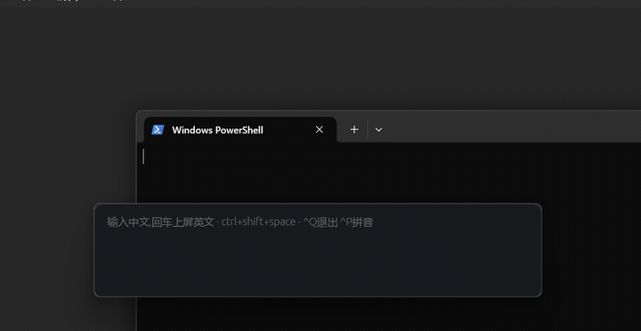

# fastrans

打中文,上屏英文。一个完全离线的本地翻译输入条,单二进制,Rust 编写。



在任何应用里按下热键,悬浮条弹出 → 打中文(或直接打拼音)→ 英文实时出现 → 回车,英文自动粘贴进你刚才所在的输入框。聊天、邮件、IDE、浏览器通用。

## 特性

- **完全离线**:本地神经翻译模型(opus-mt zh→en,int8 量化,79MB,已含在仓库里),无 API key、无网络请求
- **快**:oneDNN 后端,短句 ~30ms、长句 ~100ms,边打边译,回车零等待;等待时有加载动效,译文淡入
- **办公室口吻**:译文自动缩写化、去公文腔(can't / we'll / ASAP 而非 cannot / we will / as soon as possible),更像北美同事打出来的话(`style=0` 可关)
- **内置拼音输入**:没装中文输入法的电脑也能用——直接打拼音,数字/空格/点击选词,`-`/`=` 翻页,回车整句转换;**记住你的选词习惯**、选词后可点击**联想**接龙(`Ctrl+P` 可关,平时用系统输入法即可)
- **不打扰**:不是真输入法、不改系统设置;粘贴前保存剪贴板、粘贴后自动还原;条可拖动、位置记忆
- **自动更新**:启动时后台静默检查新版(仅在有新版时下载 ~25MB 增量包,下次启动生效);断网完全无感,配置里 `autoupdate=0` 可关

## 下载即用(Windows 10/11 x64)

去 [**Releases**](https://github.com/YSKM523/fastrans/releases/latest) 下载:

- **`fastrans-vX.Y.Z-setup.exe`(推荐)**——双击安装,中文向导,免管理员权限,可选开机自启,系统应用列表里可卸载
- **`fastrans-vX.Y.Z-windows-x64.zip`(绿色版)**——解压双击 `fastrans.exe` 即用

模型已含在包内,无需再装任何东西;之后有新版会静默自动更新。

> 首次运行若弹出 "Windows 已保护你的电脑"(SmartScreen):点 **更多信息 → 仍要运行**。这是未签名新程序的例行提示;本程序完全离线、源码公开,介意的话可对照 Release 页的 SHA256 校验,或直接从源码编译。

## 从源码构建

需要 [Rust](https://rustup.rs/)(≥1.95)和 [CMake](https://cmake.org/download/):

```powershell
git clone https://github.com/YSKM523/fastrans.git
cd fastrans
cargo build --release     # 首次 5-15 分钟(编译 CTranslate2/oneDNN)
.\target\release\fastrans.exe
```

启动后无窗口,按热键呼出。开机自启:把 exe 快捷方式放进 `shell:startup`。

Linux 需 `cmake libxdo-dev libxkbcommon-dev`(X11 可用,Wayland 注入受限);macOS 理论可编译,未实测。

## 快捷键

| 键 | 作用 |
|---|---|
| `Ctrl+Alt+Space` | 呼出 / 收起(被占用时自动降级为 `Ctrl+Shift+Space` → `Ctrl+Alt+E`,实际生效的显示在输入框提示里;`FASTRANS_HOTKEY=ctrl+alt+t` 可指定) |
| `Enter` | 英文上屏到原应用 |
| `Esc` | 收起 |
| `Ctrl+P` | 内置拼音开关(持久化) |
| `Ctrl+Q` | 退出 |

拼音模式下:数字 `1-9` 选词,空格选第一个。音节歧义用撇号:`xi'an` 西安 / `xian` 先。

## 工作原理

```
egui 悬浮条 ── debounce 120ms ──> CTranslate2 工作线程 (opus-mt int8, greedy)
     │                                    │
     │  内置拼音:音节切分 + 词频 Viterbi   │  revision 竞速,过期结果丢弃
     └── Enter ──> 保存剪贴板 → 写入英文 → 模拟 Ctrl+V → 还原剪贴板
```

不做真 IME(不碰 TSF/IBus),悬浮窗 + 剪贴板注入一套代码全平台。引擎抽象在 `engine.rs` 单文件,想换本地 LLM 或云端流式只改这一处。

## 限制

- 译文是 opus-mt 直译水准,长难句、网络用语会打折扣
- 目标应用需支持 Ctrl+V 粘贴(绝大多数都支持)
- 首发 Windows;Linux Wayland 注入受限

## License

代码 [MIT](LICENSE) © YSKM523。

第三方:翻译模型 [Helsinki-NLP/opus-mt-zh-en](https://huggingface.co/Helsinki-NLP/opus-mt-zh-en)(CC-BY-4.0);拼音词库来自 AOSP PinyinIME(Apache-2.0);[CTranslate2](https://github.com/OpenNMT/CTranslate2)(MIT);[egui](https://github.com/emilk/egui)(MIT/Apache-2.0)。
